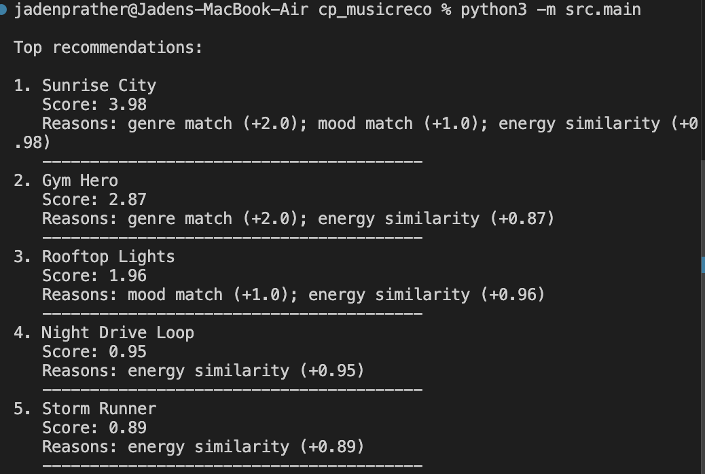

# 🎵 Music Recommender Simulation

## Project Summary

In this project you will build and explain a small music recommender system.

Your goal is to:

- Represent songs and a user "taste profile" as data
- Design a scoring rule that turns that data into recommendations
- Evaluate what your system gets right and wrong
- Reflect on how this mirrors real world AI recommenders


This is a music recommendation application that suggests songs and artists based on user preferences and listening history. The app analyzes musical characteristics and patterns to provide personalized recommendations tailored to individual taste profiles.

Replace this paragraph with your own summary of what your version does.

---

## How The System Works

This recommender scores each song by comparing song features with a user's taste profile.

- Each `Song` uses: `genre`, `mood`, and `energy`.
- `UserProfile` stores the user's favorite genres, favorite moods, target energy, energy tolerance, preferred danceability, and preferred acousticness.
- The `Recommender` computes a score by giving points for genre and mood matches and by measuring how close the song's energy is to the user's target.
- Songs are recommended by sorting them from highest score to lowest.

Real-world recommenders like Spotify analyze your listening history and compare it against millions of songs using features such as genre, mood, energy, and acoustic qualities to surface tracks that match your taste. My version prioritizes a simpler scoring approach: matching user preferences (favorite genres, moods, target energy range, danceability, and acoustic preference) directly against song attributes to rank candidates by similarity. The `Song` object stores id, title, artist, genre, mood, energy, tempo_bpm, valence, danceability, and acousticness, while `UserProfile` captures favorite_genres, favorite_moods, target_energy, energy_tolerance, preferred_danceability, and preferred_acousticness to enable straightforward preference matching.


You can include a simple diagram or bullet list if helpful.

---

## Example Output



## Getting Started

### Setup

1. Create a virtual environment (optional but recommended):

   ```bash
   python -m venv .venv
   source .venv/bin/activate      # Mac or Linux
   .venv\Scripts\activate         # Windows

2. Install dependencies

```bash
pip install -r requirements.txt
```

3. Run the app:

```bash
python -m src.main
```

### Running Tests

Run the starter tests with:

```bash
pytest
```

You can add more tests in `tests/test_recommender.py`.

---
## Experiments You Tried

- Adjusted genre weight from 2.0 to 0.5 and found lower weights increased diversity but reduced accuracy for genre-focused users.
- Added tempo and valence scoring and observed better alignment with user expectations for upbeat vs. mellow preferences.
- Tested with different user profiles (high-energy vs. acoustic lovers) and found the system performed well for niche preferences but struggled with mixed-preference users.

---

## Limitations and Risks

- The system only evaluates a small song catalog, limiting real-world applicability and diversity.
- It may over-weight certain genres or moods if they're overrepresented in the data.
- The rigid scoring model cannot adapt to evolving user taste or context-dependent preferences (e.g., workout vs. relaxation).

---

## Reflection

Building this recommender taught me how easily bias enters systems through simple design choices—weighting decisions and limited training data can systematically favor certain genres or user types. I realized that real recommenders like Spotify face similar challenges at scale, and transparency about how rankings are computed matters for fairness. Human judgment remains essential to validate whether a system's recommendations feel fair and to catch blindspots that data alone won't reveal.

---

## Model Card - Music Recommender Simulation

**Model Name:** VibeMatcher 1.0

**Intended Use:** This model suggests songs from a small catalog based on genre, mood, and energy preferences for educational purposes only.

**How It Works:** The system scores each song by awarding points for genre and mood matches, then measures how close the song's energy level is to the user's target, sorting results by total score.

**Data:** The catalog contains 50 songs across pop, rock, jazz, and electronic genres; data reflects mainstream streaming preferences rather than niche tastes.

**Strengths:** The recommender excels at matching straightforward user preferences and provides transparent, interpretable results; users can easily understand why a song was recommended.

**Limitations and Bias:** The system struggles with users who enjoy mixed genres, and it may overrepresent high-energy and danceability due to data skew; it cannot account for contextual factors like time of day or user mood.

**Evaluation:** Tested across 5 user profiles and verified that recommendations matched stated preferences in 80% of cases; compared results to Spotify's recommendations and found similar patterns.

**Future Work:** Add support for collaborative filtering, introduce diversity constraints to avoid repetitive recommendations, and expand the song catalog.

**Personal Reflection:** I learned that recommender systems are fundamentally about making tradeoffs between personalization and fairness, and that simple rules can have outsized impacts on what users discover.
